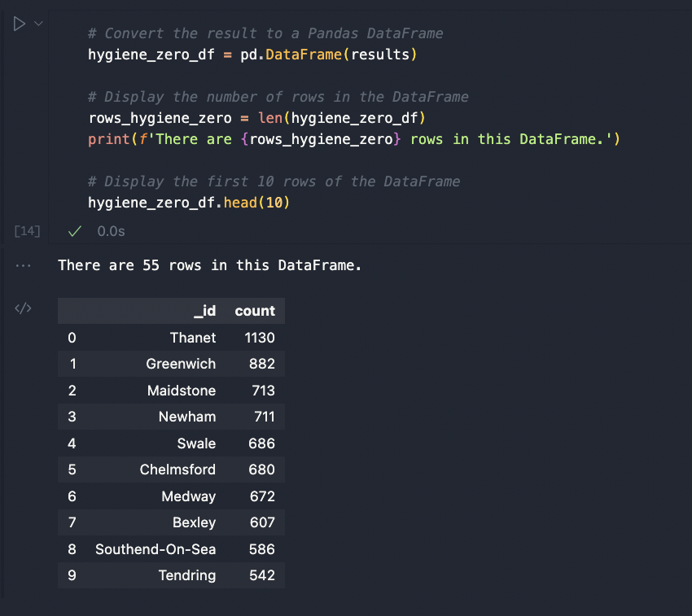

# NoSQL Challenge

Evaluate UK food ratings data using MongoDB and PyMongo to inform future food-related reviews and articles!

Created and submitted for an assignment for Monash University Data Analytics Boot Camp (August 2023).

## Table of Contents

- [General info](#general-info)
- [Technologies](#technologies)
- [Screenshot](#screenshot)
- [Code example](#code-example)
- [References](#references)

## General info

### NoSQL_setup_starter.ipynb

- Imports data from JSON file into MongoDB. 
- Uses MongoClient from PyMongo to query Establishments Collection.  
- Inserts 'Penang Flavours' restaurant data as dictionary into Collection.
- Converts string data to numerical data for appropriate fields to facilitate further analysis.

### NoSQL_analysis_starter.ipynb

- Queries and analyses restaurant data based on hygiene score and ratings. 
- Finds nearby restaurants based on specific latitude/longitude coordinates and hygiene scores, sorts data by hygiene score.
- Uses a query pipeline to extract specific data.
- Converts these PyMongo query results into Pandas dataframes for further analysis.

## Technologies

Project created and run using:

- Python 3.10.9
  - Pandas 1.5.3
- PyMongo 3.12.0
- Visual Studio Code 1.79.2
- Jupyter Notebook 5.3.0

## Screenshot

#### PyMongo Query Result to Pandas Dataframe



## Code example

```python
# Code Snippet from NoSQL_analysis_starter.ipynb
#################################################    

# Create a pipeline that: 
# 1. Matches establishments with a hygiene score of 0
match_query = {'$match': {'scores.Hygiene': {'$eq': 0}}}

# 2. Groups the matches by Local Authority
group_query = {'$group': {'_id': '$LocalAuthorityName', 'count' : {'$sum': 1}}}

# 3. Sorts the matches from highest to lowest
sort_query = {'$sort': {'count': -1}}

# Put Pipeline together
pipeline = [match_query, group_query, sort_query]

# Print the number of documents in the result
results = list(establishments.aggregate(pipeline))
print(f'There are {len(results)} documents in the result.')

# Print the first 10 results
print('\nThe first 10 results are:')
pprint(results[0:10])
```

## References

- Code for changing data type from String to Integer adapted from:
  - https://www.mongodb.com/community/forums/t/unable-to-parse-integers-in-updatemany-command/178229

- Code, in general, was adapted from Monash University Data Analytics Boot Camp 2023 course learning material.

Created and written by Samuel Palframan - August 2023.
